# DSA 210 Project — Demand Analysis for Plastic Buckets in the Dairy Industry

**Author:** Ömer Doğru  
**Course:** DSA 210 — Introduction to Data Science (Spring 2026)  
**Institution:** Sabancı University

---

## Table of Contents
- [Motivation](#motivation)
- [Data Sources](#data-sources)
- [Exploratory Data Analysis](#exploratory-data-analysis)
- [Hypothesis Testing](#hypothesis-testing)
- [Machine Learning Models](#machine-learning-models)
- [Key Findings](#key-findings)
- [Limitations and Future Work](#limitations-and-future-work)
- [Repository Structure](#repository-structure)
- [How to Reproduce](#how-to-reproduce)
- [AI Tool Disclosure](#ai-tool-disclosure)

---

## Motivation

My family owns a plastic injection factory in Osmaniye, Turkey, producing buckets primarily for yogurt manufacturers across the country. Over the years, I noticed that sales increase during warmer months — likely because dairy consumption (and therefore bucket demand) rises with temperature. This project aims to test that intuition with data, and to understand what other factors drive demand.

## Data Sources

| Dataset | Source | Frequency | Period |
|---|---|---|---|
| Plastic bucket sales (tons) | Family factory records | Weekly | 2023–2025 |
| Temperature & precipitation (10 cities) | [Open-Meteo API](https://open-meteo.com/) | Daily → weekly | 2023–2025 |
| Brent crude oil price | Yahoo Finance (`BZ=F`) | Daily → weekly | 2023–2025 |
| USD/TRY exchange rate | Yahoo Finance (`TRY=X`) | Daily → weekly | 2023–2025 |

- **156 weekly observations**, 14 variables, **zero missing values**
- Turkey-wide temperature: population-weighted average of 9 major cities
- Osmaniye (factory location) kept as a separate signal

---

## Exploratory Data Analysis

Full analysis: [`dsa210/01_eda.ipynb`](dsa210/01_eda.ipynb)

### Sales Time Series (2023–2025)

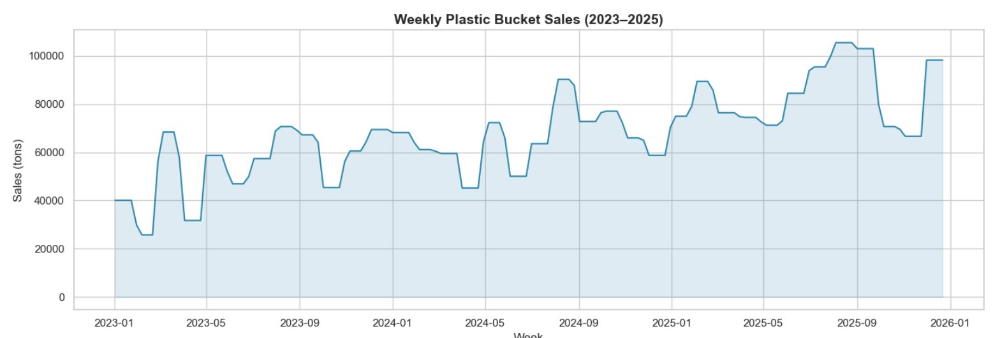

The series shows a clear **upward trend** and a **recurring seasonal pattern** — peaks in summer, troughs in winter.

### Year-over-Year Comparison

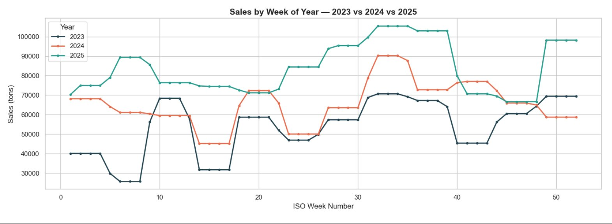

Each year sits above the previous one. Growth was 21.8% in 2024 and 28.0% in 2025.

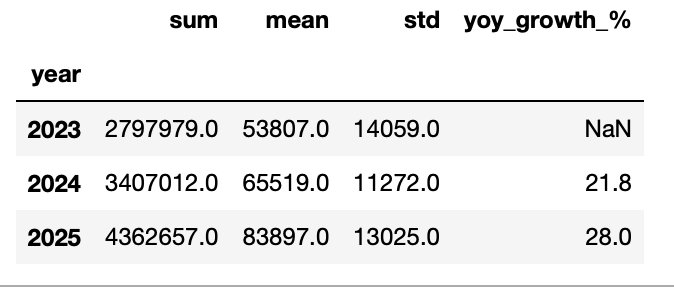

### Seasonality

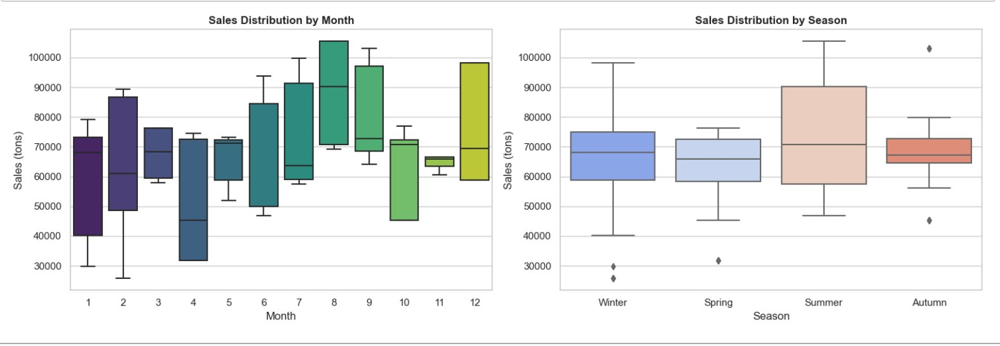

Monthly boxplots show sales rising from spring through summer (months 6–9), then declining. The seasonal boxplot shows summer has a higher median and wider range.

### Temperature vs. Sales

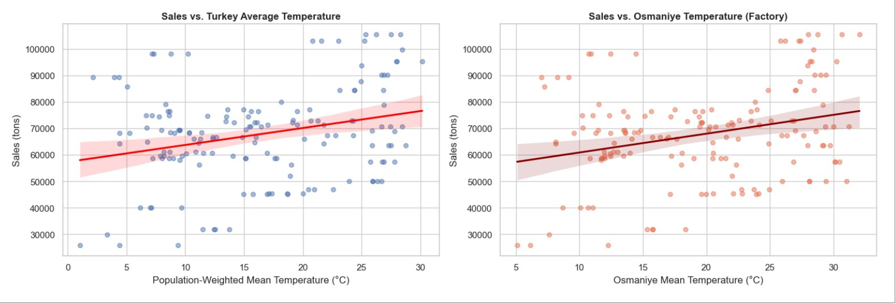

A positive trend is visible: warmer weeks tend to have higher sales, though with substantial scatter.

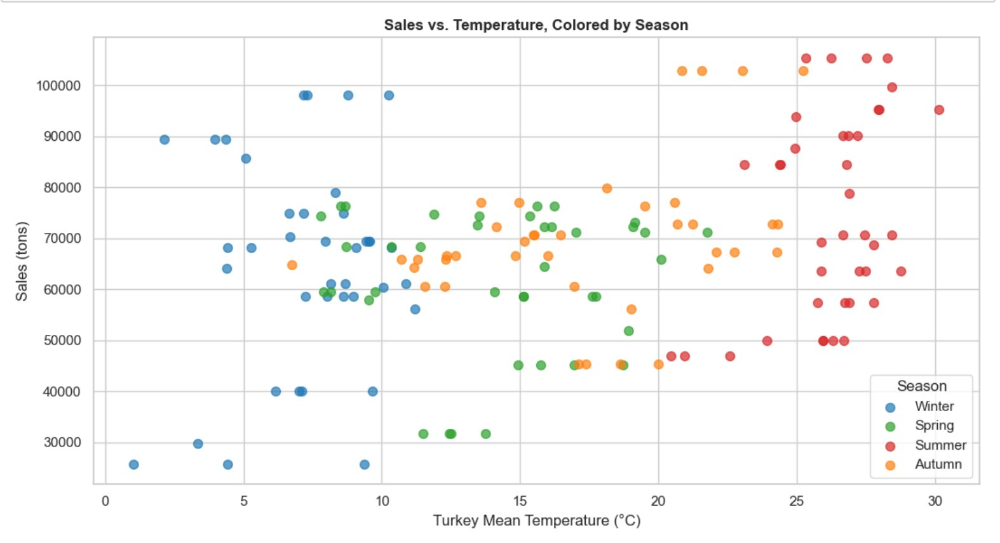

Coloring by season shows that the seasons stratify along the temperature axis, with summer (red) clustering at higher temperatures and sales.

### Sales Distribution

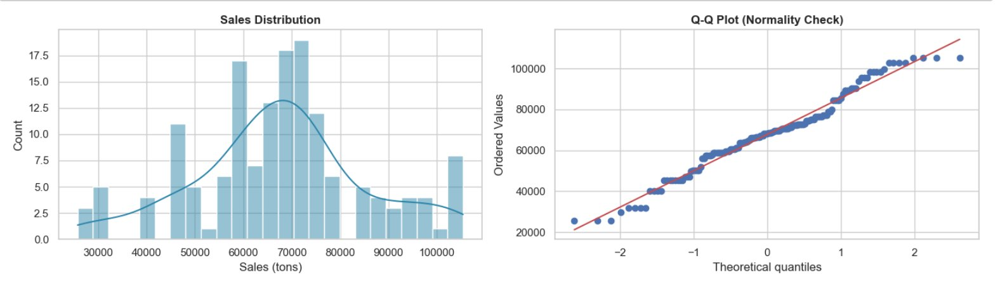

The distribution is roughly bell-shaped but the Q-Q plot shows deviation at the tails. Shapiro-Wilk test rejects normality — this informed our choice of **non-parametric tests**.

### External Drivers

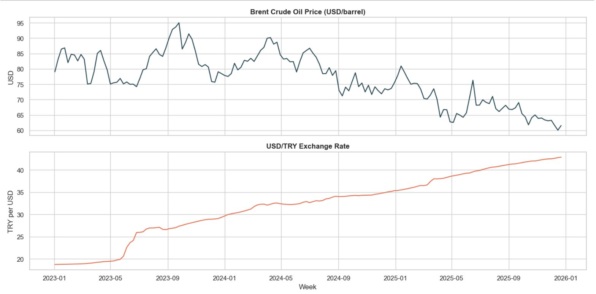

Brent oil declined from ~$85 to ~$60 over the period, while USD/TRY rose from ~19 to ~43. Both trends run opposite/parallel to sales, raising the possibility of spurious correlations.

---

## Hypothesis Testing

Full analysis: [`dsa210/02_hypothesis_tests.ipynb`](dsa210/02_hypothesis_tests.ipynb)

### Summary of Results

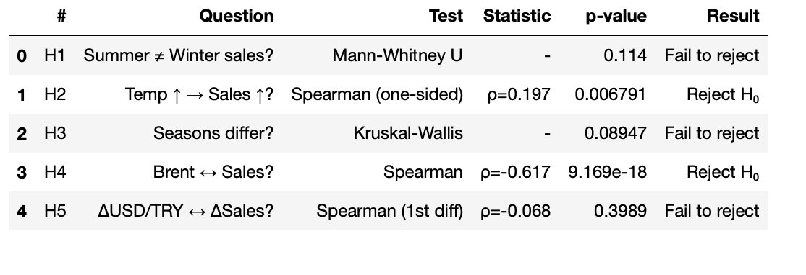

| # | Hypothesis | Test | Statistic | p-value | Result |
|---|---|---|---|---|---|
| H1 | Summer ≠ Winter sales | Mann-Whitney U | - | 0.114 | Fail to reject |
| H2 | Temp ↑ → Sales ↑ | Spearman (one-sided) | ρ = 0.197 | 0.007 | **Reject H₀** |
| H3 | Seasons differ | Kruskal-Wallis | - | 0.089 | Fail to reject |
| H4 | Brent ↔ Sales | Spearman | ρ = -0.617 | ≈ 0 | **Reject H₀** |
| H5 | ΔUSD/TRY ↔ ΔSales | Spearman (1st diff) | ρ = -0.068 | 0.399 | Fail to reject |

### Key Interpretations

**H1 & H3 — Seasonality weaker than expected:** While summer sales *look* higher in boxplots, the tests didn't reach significance. Why? The strong year-over-year growth creates large within-season variance — winter 2025 sales exceed summer 2023 sales simply because the factory grew. A detrended analysis would likely reveal stronger seasonality.

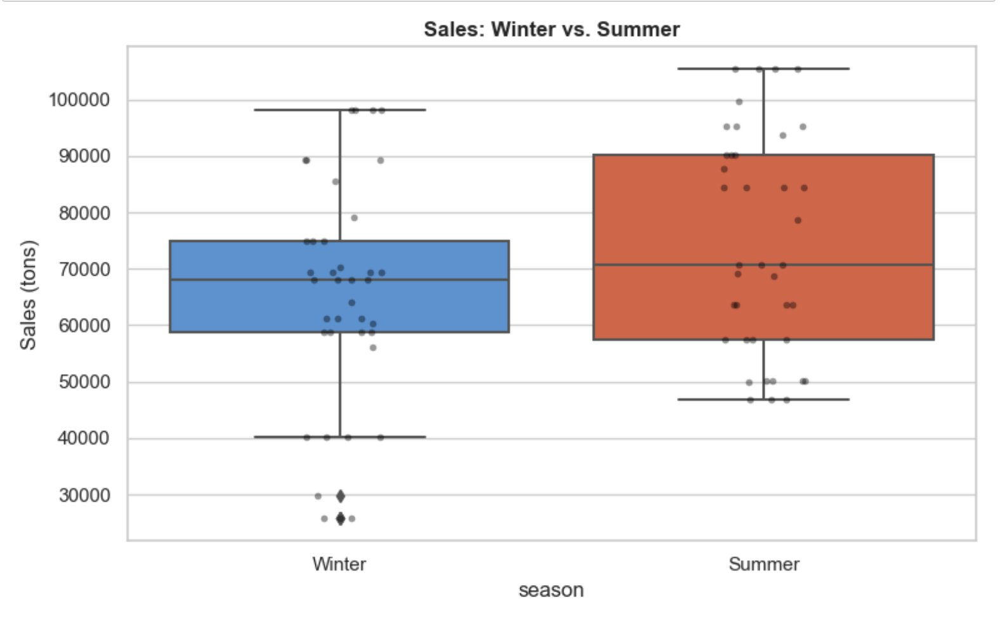

**H2 — Temperature effect is real but modest:** Spearman ρ = 0.197 (p = 0.007) confirms warmer weeks are associated with higher sales, but the correlation is weaker than expected from visual inspection.

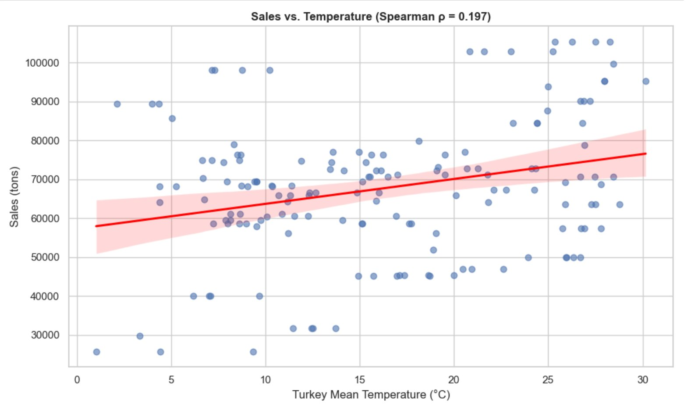

**H4 — Brent correlation is spurious:** The strong negative correlation (ρ = -0.617) simply reflects opposite trends: oil prices fell while sales rose. This is **not** a causal link — it's the same spurious correlation phenomenon we checked for in H5.

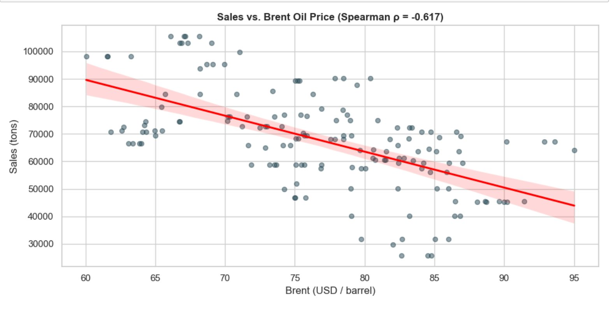

**H5 — No FX-demand link after detrending:** First-differencing removes the common trend, and the relationship vanishes (ρ = -0.068, p = 0.399).

---

## Machine Learning Models

Full analysis: [`dsa210/03_ml_models.ipynb`](dsa210/03_ml_models.ipynb)

### Features Used
- Lag features (sales lag 1-week, 2-week, 4-week rolling average)
- Temperature (Turkey average, Osmaniye, 1-week lag)
- Financial (Brent, USD/TRY)
- Temporal (time index, month sin/cos, season dummies)

### Model Comparison (Test Set)

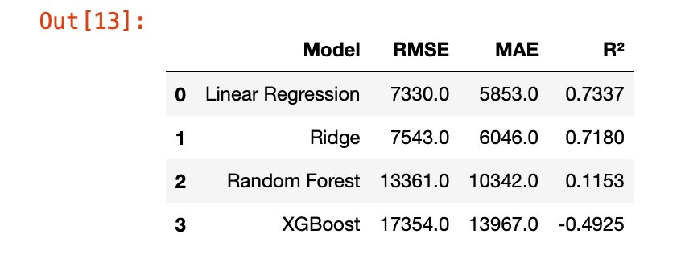

| Model | RMSE | MAE | R² |
|---|---|---|---|
| **Linear Regression** | **7,330** | **5,853** | **0.734** |
| Ridge (α=10) | 7,543 | 6,046 | 0.718 |
| Random Forest | 13,361 | 10,342 | 0.115 |
| XGBoost | 17,354 | 13,967 | -0.493 |

**Linear Regression won.** With only 156 observations, tree-based models overfit the training data. Simpler models generalize better — more complex is not always better.

### Feature Importance

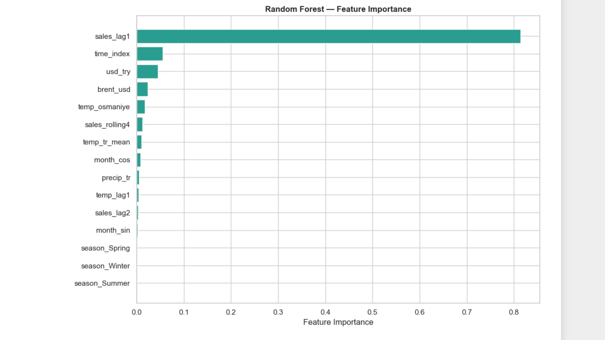

**sales_lag1** dominates at ~80% importance. Temperature scored lower than expected because the lag implicitly carries temperature info (warm week → high sales → high lag). The **time_index** captures the growth trend — confirming the assistant's suggestion to include it.

---

## Key Findings

1. **Growth trend dominates.** Year-over-year growth (22–28% annually) is the strongest signal, likely from new customers or capacity expansion — "hidden features" not in the data.
2. **Temperature has a real but modest effect.** Spearman ρ = 0.197 (p = 0.007) confirms warmer weeks → higher sales, but the growth trend adds noise.
3. **Seasonality is present but masked by growth.** Standard tests failed to reach significance because within-season variance is inflated by the trend.
4. **Brent oil correlation is spurious.** The strong ρ = -0.617 reflects opposite trends, not causation.
5. **Simple models beat complex ones on small data.** Linear Regression (R² = 0.734) outperformed Random Forest and XGBoost.
6. **Sales momentum is the strongest short-term predictor.** The 1-week lag feature dominated importance.

---

## Limitations and Future Work

### Limitations
- **Small sample size (156 weeks)** — limits complex model performance
- **Monthly-to-weekly conversion** — approximation, not true weekly sales
- **Growth trend confounds seasonal analysis** — detrending needed
- **Hidden factors** (new customers, capacity changes) not captured
- **Lag features limit forecast horizon** to 1–2 weeks

### Future Work
- Collect actual weekly sales data
- Detrend before seasonal analysis to isolate pure seasonal effects
- Add dairy sector indicators (milk prices, TUIK yogurt production)
- Include Ramadan period as a feature
- Try ARIMA or Prophet for native trend/seasonality handling
- Add polypropylene price data for cost-side analysis

---

## Repository Structure

```
dsa210-data-science-project/
├── README.md
├── AI_USAGE.md
├── requirements.txt
├── DSA210_Final_Report_Omer_Dogru.pdf
├── dsa210_proposal.pdf
├── plots/                        # Visualizations for README
└── dsa210/
    ├── collect_data.py
    ├── 01_eda.ipynb
    ├── 02_hypothesis_tests.ipynb
    ├── 03_ml_models.ipynb
    └── data/
        ├── raw/
        └── processed/
            └── merged_weekly.csv
```

## How to Reproduce

```bash
pip install -r requirements.txt
cd dsa210
python collect_data.py
jupyter notebook 01_eda.ipynb
jupyter notebook 02_hypothesis_tests.ipynb
jupyter notebook 03_ml_models.ipynb
```

## AI Tool Disclosure

AI tools (Claude by Anthropic and Chatgpt) were used for code debugging, and structuring. All analytical decisions were made by me. Full disclosure: [AI_USAGE.md](AI_USAGE.md)
